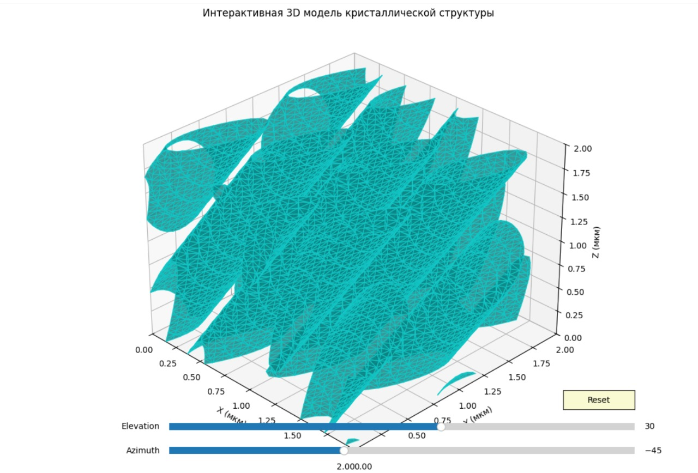
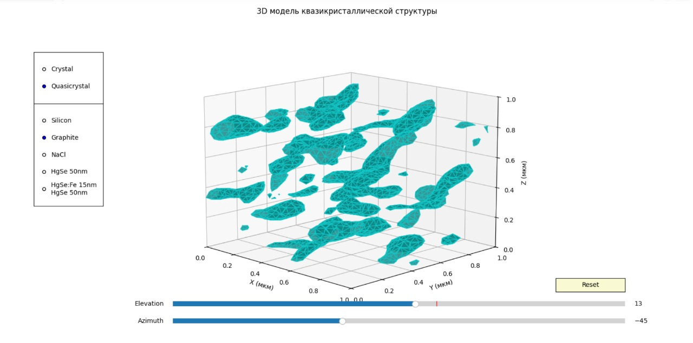

# CrystalModeling: Interactive 3D Crystal Structure Viewer

## Описание программы

Эта программа предоставляет интерактивный инструмент для визуализации 3D-моделей кристаллических и квазикристаллических структур. Программа позволяет исследовать различные типы кристаллических решеток и их сложные геометрические паттерны.

## Теоретическая справка

### Кристаллы
Кристаллы — это твердые вещества, в которых атомы, молекулы или ионы расположены в строго определенной, периодически повторяющейся структуре. Кристаллическая решетка характеризуется высокой степенью симметрии и дальним порядком. Примеры: алмаз, кварц, поваренная соль.

### Квазикристаллы
Квазикристаллы — это особый класс твердых тел, которые обладают упорядоченной, но непериодической структурой. Их атомная структура демонстрирует запрещенную в классической кристаллографии симметрию (например, пятерную). В отличие от обычных кристаллов, квазикристаллы имеют дальний порядок, но без трансляционной симметрии.

## Возможности программы

1. Визуализация различных типов кристаллических структур:
   - Классические кристаллы (модель интерференции световых волн)
   - Материальные кристаллы (специфические атомные структуры)
   - Квазикристаллы (непериодические структуры)

2. Поддерживаемые материалы:
   - Кремний (алмазная структура)
   - Графит (гексагональная структура)
   - NaCl (гранецентрированная кубическая)
   - HgSe (цинковая обманка)
   - Многослойная структура HgSe:Fe/HgSe

3. Интерактивные элементы управления:
   - Выбор типа структуры (кристалл/квазикристалл)
   - Выбор конкретного материала
   - Регулировка угла обзора 3D-модели
   - Кнопка сброса вида

## Требования

Для работы программы необходимы:
- Python 3.6+
- Установленные пакеты:
  - numpy
  - matplotlib
  - scikit-image

## Установка

1. Установите необходимые зависимости:
```bash
pip install numpy matplotlib scikit-image
```

2. Запустите программу:
```bash
python crystal_visualizer.py
```

## Использование

1. Выберите тип структуры (кристалл или квазикристалл) с помощью радиокнопок в левой части интерфейса.
2. Для кристаллов вы можете выбрать конкретный материал из списка.
3. Используйте слайдеры для изменения угла обзора 3D-модели.
4. Кнопка "Reset" возвращает вид по умолчанию.

## Примеры визуализации




